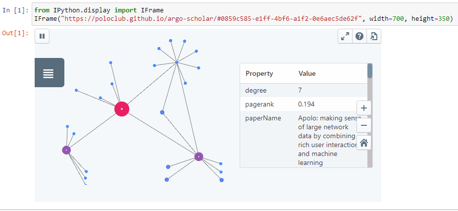

# Argo Scholar

[](https://app.travis-ci.com/poloclub/argo-scholar)
[](https://arxiv.org/abs/2110.14060)
[](https://github.com/poloclub/argo-scholar/blob/main/LICENSE)

An interactive literature exploration visualization system that runs in your web browsers. **No installation needed.**


[**Launch Argo Scholar in your browser**](https://poloclub.github.io/argo-scholar/)


## Quick Start

For beginners, Argo Scholar provides 2 built-in sample paper citation and reference networks for literature exploration: **Deep Learning** and **Apolo Sample**.

If you have launched Argo Scholar with the above link, **Deep Learning** will automatically be displayed. You can also load sample networks at any time by selecting `Graph -> Load Sample` in the top menu.

### Basic navigation

Whether you are on mouse/keyboard or a touchscreen device, you can learn the basic navigation using the `Help (?)` button on the top right corner of the app. This will help you learn how to pan, zoom and select nodes.

If you are on a device with small screen and cannot see the top menu, you can click the expand button to bring up the full Argo Scholar UI.

### Force-directed Layout

Once you have launched the sample network, you will see a play/pause button on the top menu bar. This is for interactive force-directed layout, which helps to position your nodes.


### Graph Options Panel

Argo Scholar gives a default visualization by coloring and sizing the nodes based on their [PageRank](https://en.wikipedia.org/wiki/PageRank) or [Degree](https://en.wikipedia.org/wiki/Degree_(graph_theory)) values. You can update these settings using the panel on the left (when you are not selecting any node).


### Override Individual Nodes

If you select a node, you will see the `Graph Options Panel` changed into override mode. You can override the global settings by giving these selected nodes a different look!


### Pinning and Unpinning

If you want to fix the positions of certain nodes when other nodes are running force-directed layout, you can select a node or a group of nodes and use the `Pin` button on the selection menu that pops up. (By default, if you select a node and drag it to a new position, it will already be pinned).

To unpin, just select them again and click the `Unpin` button.


## Exploring Your Own Network

In order to build your network from the scratch, you may want to start with a blank canvas. Argo Scholar allows you to start your own literature exploration process from an empty graph at any time by simply selecting `Graph -> New...`

### Adding Nodes via Search
To add new paper nodes, you can utilize the search bar on the top. Argo Scholar allows search by keyword or *Corpus ID*. You can do this to add as many papers as you so wish yo your network graph. 


> **_NOTE:_**  You can look up the *Corpus ID*  of a paper through [Semantic Scholar%](https://www.semanticscholar.org/). The CorpusID will be located on the paper's Semantic Scholar page, next to the paper title.  
> 
> 


### Incrementally Adding Neighbors

Now we have starting paper nodes, we can add some neighbor nodes! 

Right-click the paper you find interesting. You will see the option to either `Add 5 Paper Citations` or `Add 5 Paper References`. Clicking either option will add 5 addition papers of either category to the literature network. You can keep on adding neighbors until you have added all possible papers. 

After adding the citations or references, you can now explore the newly added nodes. If you are not find certain papers interesting or relevant, you can hide them from view by clicking on the paper and selecting `Hide`. 

Now select 1 paper that you find interesting, you will see a `Neighbors (xx nodes hidden)` button on the floating selection menu. Clicking on it will bring you to the *Neighbor Menu*.

In the *Neighbor Menu*, you can see a table listing all the neighbor nodes and their attributes. You can sort them by their attributes, individually add or hide them in the network, or use the tools above to add an arbitrary number of neighbors with top `PageRank` or `Degree` values. This helps you identify highly cited papers that has cited or is cited by the current selected paper that you are interested in.


If you are using a mouse (as opposed to a touchscreen device), you can find a shortcut to do the same thing by right clicking a node.

You can also individually manage nodes in `Tools -> Data Sheet`.

When you are done, save or share your snapshot using the `Graph` menu!

## Saving and Sharing

### Network Snapshots

Argo saves your visualization and exploration progress into *snapshots*. A snapshot includes the full network data (including nodes and connections) as well as the current visualization settings. 

You can capture a snapshot using the `Graph -> Save Snapshot` for saving locally, or `Graph -> Publish and Share Snapshot` for saving your snapshot to a URL/link. You can also rename the snapshot by clicking on its name (`Untitled Graph` by default) on the menu bar.

If you have saved your snapshot, you can import the network at anytime in the future and resume right where you left off.

You can find sample files to import in the `samples` directory of this repository.

Now try using `Graph -> Open Snapshot`.

### Sharing as links/URLs

Now try `Graph -> Publish and Share Snapshot`.

By sharing your literature network with a link, anyone can load the network through the link later. It's a great tool for sharing and collaboration.


### Sharing as Embedded Widgets

On the same screen where you get your sharable URL, you can also copy the iframe code for embedding the snapshot. Argo Scholar allows you to embed any snapshot URL in iframes. This is perfect for publishing your literature network on online articles, blog posts or interactive notebooks (such as a Jupyter Notebook).



### About Sharing Service

We provide a public sharing service for public datasets. If you want to establish your own sharing server for private or proprietary datasets, refer to the [Deployment Guide](deploy.md) to easily set up your own sharing service!


## Documentations 
If you want to learn about the development process or how to deploy your own version of Argo Scholar, please check out the following documentations:

- [Development Guide](documentations/development.md) (Developing Argo Scholar)
- [Deployment Guide](documentations/deploy.md) (Deploy Argo Scholar and custom sharing service with access)
  
## Credits
♥ Argo Scholar was developed and maintained by [Kevin Li](https://github.com/kevinli573), [Alex Yang](https://github.com/AlexanderHYang), [Anish Upadhayay](https://github.com/aupadhayay3), [Zhiyan Zhou](https://github.com/FZ2000), [Jon Saad-Falcon](https://github.com/jonsaadfalcon), [Duen Horng Chau](https://github.com/polochau) from [Polo Club of Data Science](https://poloclub.github.io/) at Georgia Tech.
## Citation
```bibTeX
@inproceedings{li2022argoscholar, 
  author = {Li, Kevin and Yang, Haoyang and Montoya, Evan and Upadhayay, Anish and Zhou, Zhiyan and Saad-Falcon, Jon and Chau, Duen Horng},
  title = {Visual Exploration of Literature with Argo Scholar},
  year = {2022},
  isbn = {9781450392365},
  publisher = {Association for Computing Machinery},
  url = {https://doi.org/10.1145/3511808.3557177},
  doi = {10.1145/3511808.3557177}
}
```

## License
Argo Scholar is available under the  [MIT License](LICENSE).
Argo Scholar uses the Semantic Scholar Open Research Corpus API, which is licensed under [ODC-BY](https://opendatacommons.org/licenses/by/1.0/).
More can be found here: [*Waleed Ammar et al. 2018. Construction of the Literature Graph in Semantic Scholar. NAACL*](https://www.semanticscholar.org/paper/09e3cf5704bcb16e6657f6ceed70e93373a54618)

## Contact
If you have any questions or would like to learn more about the project, feel free to contact [Kevin Li](mailto:kevin.li@gatech.edu) or [Alex Yang](https://alexanderyang.me).

