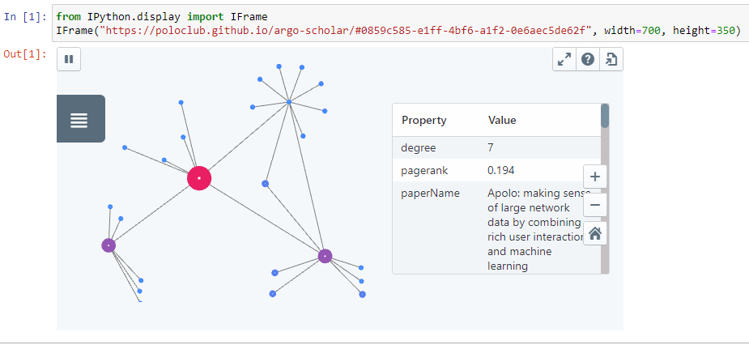

# Argo Scholar Quick Start Guide

This is a quick start guide introducing the basic features of Argo Scholar. Let's begin by launching Argo Scholar in your browser!

[Launch Argo Scholar](https://poloclub.github.io/argo-scholar/)

For the purpose of this quick start, we will be working with built-in sample graph visualizing the [Apolo](https://www.semanticscholar.org/paper/Apolo%3A-making-sense-of-large-network-data-by-rich-Chau-Kittur/42936c2f2f5c8f4152494b94609fb33ec6264b8b) paper citation and reference network.

If you have launched Argo Scholar with the above link, this sample graph will automatically be displayed. If you have launched Argo with another graph, you can navigate to this graph by selecting `Graph -> Load Sample -> Apolo Sample` in the top menu.

If you are on a device with small screen and cannot see the top menu, you can click the expand button to bring up the full Argo Scholar UI.

## Basic navigation

Whether you are on mouse/keyboard or a touchscreen device, you can learn the basic navigation using the `Help button` on the top right corner of the app. This will help you learn how to pan, zoom and select nodes.

## Interactive Visualization

Let's begin by playing around this small sample!

### Force-directed Layout

Once you have launched the graph, you will see a play/pause button on the top menu bar. This is for interactive force-directed layout, which helps to position your nodes.

### Graph Options Panel

Argo Scholar gives a default visualization by coloring and sizing the nodes based on their [PageRank](https://en.wikipedia.org/wiki/PageRank) or [degree](https://en.wikipedia.org/wiki/Degree_(graph_theory)) values. You can update these settings using the panel on the left (when you are not selecting any node).

### Override Individual Nodes

If you select a node, you will see the graph options panel changed into override mode. You can override the global settings by giving these selected nodes a different look!

### Pinning and Unpinning

If you want to fix the positions of certain nodes when other nodes are running force-directed layout, you can select a node or a group of nodes and use the pin button on the selection menu that pops up. (By default, if you select a node and drag it to a new position, it will already be pinned).

To unpin, just select them again and click the unpin button.

## Saving and Sharing

### Graph Snapshots

Argo saves your visualization and exploration progress into *snapshots*. A snapshot includes the full graph data as well as the current visualization settings. You can capture a snapshot using the `Graph -> Save Snapshot` for saving locally, or `Graph -> Publish and Share Snapshot` for saving your snapshot to a URL/link.

### Sharing as links/URLs

Now try `Graph -> Publish and Share Snapshot`.

By sharing your graph with a link, anyone can load the graph through the link later. It's a great tool for sharing and collaboration.

### Sharing as embedded widgets

On the same screen where you get your sharable URL, you can also copy the iframe code for embedding the snapshot. Argo Scholar allows you to embed any snapshot URL in iframes. This is perfect for publishing your graph on online articles, blog posts or interactive notebooks (such as a Jupyter Notebook).

### About Sharing Service

We provide a public sharing service for public datasets. If you want to establish your own sharing server for private or proprietary datasets, refer to [the deployment guide](deploy.md) to easily set up your own sharing service!

## Next Steps

Congratulations for completing the Quick Start! Argo Scholar has many other awesome features to explore.

If you want to learn about importing your own data, or how to incrementally explore a larger graph, please head to [the tutorial](tutorial.md).