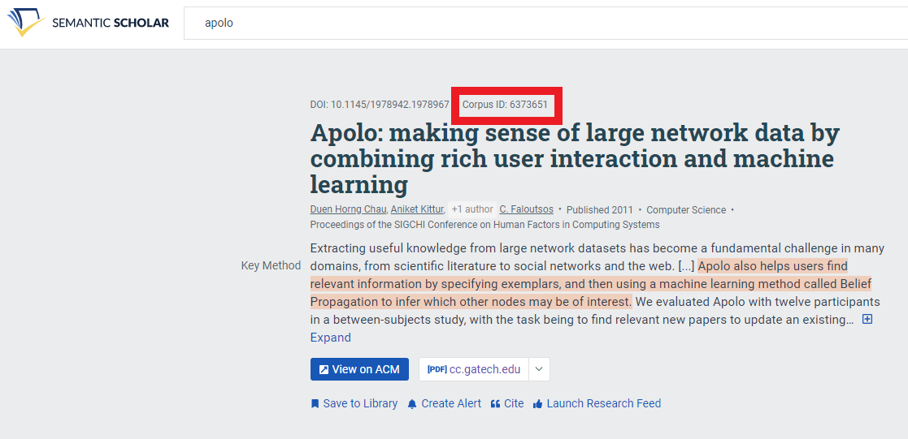

# Argo Scholar Tutorial with Apolo Paper

This tutorial assumes that you have already completed [the Quick Start Guide](quickstart.md). In addition to the quick start, this tutorial covers:

- How to initialize your own graph
- How to incrementally explore your own graph's citation and reference network

We will start our literature graph with the Apolo paper found [here](https://www.semanticscholar.org/paper/Apolo%3A-making-sense-of-large-network-data-by-rich-Chau-Kittur/42936c2f2f5c8f4152494b94609fb33ec6264b8b#citing-papers).

If you want to insert your own papers, all you will need is the paper's Semantic Scholar CorpusID. You can locate this by searching for the paper on [Semantic Scholar's website](https://www.semanticscholar.org/). The CorpusID will be located on the paper's Semantic Scholar page, next to the paper title.  

Now let's get started!

## Initializing the graph 

When you first open Argo Scholar, you should see the sample Apolo graph. In order to build your graph from the ground up, you will need to start with an empty graph. 

You can do this by clicking on the `Papers` tab and selecting `Clear all papers`.

Now you can add your paper nodes. Use `Papers -> Add Papers` to see the add paper popup. Input the paper's CorpusID to add it to the graph. You can do this with as many papers as you so wish.

## Incrementally Adding Neighbors

Now we have starting paper nodes, we can add some neighbor nodes! 

Right-click the paper you find interesting. You will see the option to either `Add 5 Paper Citations` or `Add 5 Paper References`. Clicking either option will add 5 addition paper nodes to the graph. You can keep on adding neighbors until you have added all possible papers. 

After adding the citations or references, you can now explore the newly added nodes. If you are not find certain papers interesting or relevant, you can hide them from view by clicking on the paper and selecting `Hide`. 

Now select 1 paper that you find interesting, you will see a `Neighbors (xx nodes hidden)` button on the floating selection menu. Clicking on it will bring you to the *Neighbor Menu*.

In the *Neighbor Menu*, you can see a table listing all the neighbor nodes and their attributes. You can sort them by their attributes, individually add or hide them in the graph, or use the tools above to add an arbitrary number of neighbors with top PageRank or degree values. This helps you identify highly cited papers that has cited or is cited by the current selected paper that you are interested in.

If you are using a mouse (as opposed to a touchscreen device), you can find a shortcut to do the same thing by right clicking a node.

You can also individually manage nodes in `Tools -> Data Sheet`.

When you are done, save or share your snapshot using the `Graph` menu!

## Continuing Where You Left Off

If you have saved your snapshot, you can import the graph at anytime in the future, and resume right where you left off.

You can find sample files to import in the `samples` directory of this repository.

Now try using `Graph -> Open Snapshot`.

## Next Steps

Congratulations! You have learned how to import graph data as well as incremnetally exploring a graph. If you are interested in customizing Argo Scholar or deploying your own sharing service, please refer to [the Development Guide](development.md) and [the Deployment Guide](deploy.md)